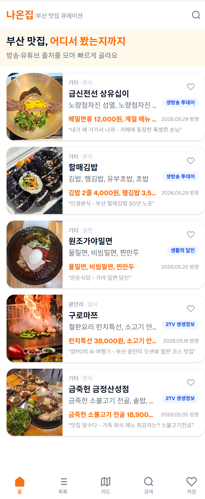
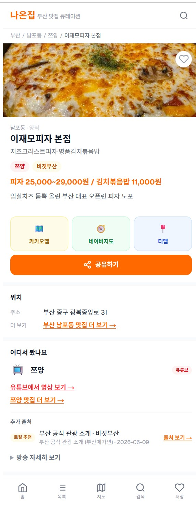
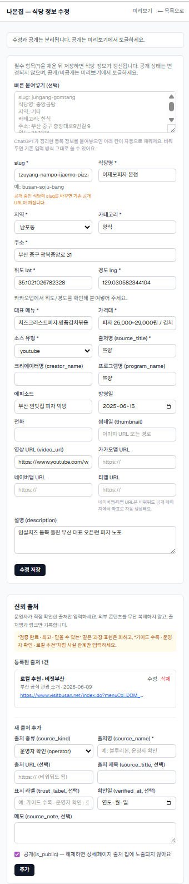

# 사업화는 접었지만, 운영 능력은 남았다 — 1인 + AI 서비스 제작기

> 부제: 부산 방송맛집 앱으로 시작해서 AI 운영 포트폴리오로 끝낸 이야기
> (대체 제목: "이거 돈 되냐?" — AI랑 서비스 하나를 끝까지 만들어 본 결론)

## 시작은 단순했다

부산에서 방송·유튜브에 나온 맛집을 모아 보여주는 앱. "방송에 나왔다"는 그럴듯한 후킹이라
생각했다. AI(Claude Code)와 함께 며칠 만에 홈·목록·상세·지도·검색·저장까지 골격을 세웠다.
실행은 정말 빨랐다.

## 피드백에서 한계가 보였다

사람들에게 보여주니 반응이 미지근했다.

- "방송맛집만으로는 신뢰가 안 간다"
- "예약 기능도 없네?"
- "캐치테이블 있는데 이걸 왜 써?"

맞는 말이었다. 예약·웨이팅 인프라가 필요한 플랫폼과 1인이 정면으로 붙는 건 현실적이지 않았다.

## 방향을 둘 다 틀었다

**제품 방향** — "방송맛집"이라는 좁은 정체성을 줄이고, **"어디서 봤는지(출처)를 함께 보여주는
부산 맛집 큐레이션"** 으로 바꿨다. 방송·유튜브뿐 아니라 가이드(미쉐린)·로컬(비짓부산) 같은 출처를
칩과 링크로 붙일 수 있게 데이터 구조부터 다시 설계했다.

**사업 방향** — 억지 사업화 대신, **"AI로 서비스를 어디까지 만들고 운영할 수 있는가"를 보여주는
포트폴리오**로 정리하기로 했다. 실패가 아니라 방향 전환이었다.

## 그 사이에 실제로 만든 것

- **데이터 운영**: 후보 수집 → 좌표 지오코딩 → 비공개 적재 → 검증 통과해야 공개되는 파이프라인.
  1회성 스크립트는 실행 후 지우고 리포트만 남겨 감사 추적이 되게 했다.
- **이미지 운영**: 저작권 애매한 외부 이미지는 안 썼다. 운영자 실사진/공개 라이선스/생성 placeholder만.
- **SEO**: 구조화 데이터, 동적 OG 이미지, ISR, 지역·프로그램별 랜딩.
- **Admin CMS**: 후보를 식당으로 변환·게시하는 워크플로, 편집, 제보 큐, 신뢰 출처 입력 화면.

- **신뢰 출처**: 설계 → 운영 DB 적용 → 런타임 안전 조회 → Admin 입력 → 상세 표시 → 링크 검증 →
  후보 리포트 → 실데이터 import까지 끝단을 다 통과시켰다.

모든 걸 작은 Phase로 쪼개 매번 타입체크·빌드·실제 화면 노출까지 확인하고 문서로 남겼다.
(공개 91곳 · 정적 223페이지 · commit 130+개)

## 핵심 교훈 세 가지

1. **AI는 실행을 빠르게 하지만, 판단은 사람이 해야 한다.** 스키마·UI·검증은 AI가 척척 했지만,
   "방송맛집은 신뢰가 약하다", "사업화 대신 포트폴리오로 가자"는 사람의 몫이었다.
2. **사업화와 포트폴리오화는 다른 게임이다.** 무리해서 전자를 쫓다 둘 다 놓치느니, 솔직하게
   후자를 택했다.
3. **작은 실서비스는 AI 운영 능력을 증명하는 좋은 자산이다.** 데이터·이미지·SEO·Admin·신뢰 구조까지
   "운영"이 도는 작은 서비스. 이게 말보다 강하다.

## 결론

큰돈을 벌지는 못했다. 시장에서 검증했다고 말할 수도 없다.
하지만 **1인 + AI로 실제 운영 가능한 서비스와 운영 체계를 끝까지 만들 수 있다**는 건 남았다.
다음엔 이 능력을 다른 곳에 쓰면 된다.

---

> 발행 메모: 수치는 사실 범위로만. "돈 된다"·"시장 검증 완료"·"성공한 서비스" 같은 표현은 쓰지 않는다.
> 캡처 삽입 완료(PORT-P4): A1 홈 → A2 신뢰출처 상세 → A3 Admin 입력 (docs/portfolio/assets/).
> 외부 플랫폼(브런치 등) 발행 시 이미지 3장을 함께 업로드할 것.
